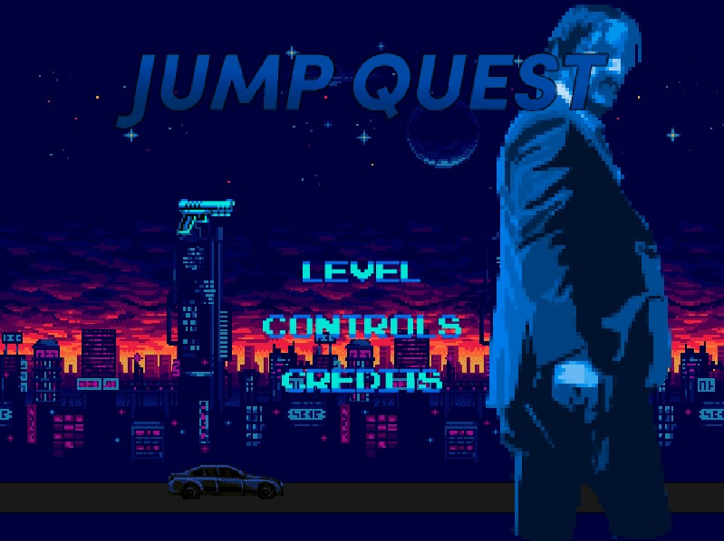

# Jump Quest - NES-Inspired Action Platformer

Welcome to Jump Quest, an action-packed 2D platformer game created in Processing Java. Embark on a thrilling adventure inspired by the fake NES tribute to the iconic John Wick movie franchise. Dive into the nostalgia of retro gaming as you experience what John Wick would've looked like if it were an NES game released back in the day.

## Table of Contents

- [Introduction](#introduction)
- [Features](#features)
- [Gameplay](#gameplay)
- [Installation](#installation)
- [Controls](#controls)
- [Shop](#shop)
- [Secret Minigame](#secret-minigame)
- [Custom UI](#custom-ui)
- [Credits](#credits)
- [Acknowledgments](#acknowledgments)

## Introduction

In Jump Quest, you step into the shoes of the legendary John Wick, engaging in relentless action and challenging platforming levels reminiscent of classic NES games. Upgrade your weapons, manage your resources, and combat various enemy types to progress through the stages and reach the ultimate goal.

## Features

- **Multiple Levels**: Explore a series of enticing and creatively designed levels that test your platforming and combat skills.
- **NES-Inspired Visuals**: Immerse yourself in the nostalgic charm of 8-bit graphics, paying tribute to the NES era.
- **Economy System**: Utilize an in-game economy to upgrade your weapons between pistol, assault rifle, and shotgun, each with unique attributes. Purchase ammo and health to stay in the game.
- **Diverse Enemy Types**: Battle against three different enemy types, each with its distinct AI: melee (swift and weak but aggressive), assault (shoots from medium range), and brute (tough to kill, wields a shotgun, and guards specific areas).
- **CSV-based Map and Entity Indexing**: The game employs a CSV file to index tile types for both the map and entities, making it easy to customize levels and enemy positions.
- **Intuitive Controls**: Use WASD to move and jump while employing the left-click to shoot down foes.
- **Shop**: Access the in-game shop by pressing 'B', where you can buy weapon upgrades, ammo, and health.
- **Secret Minigame**: Discover a hidden endless shooter minigame in the credits menu, where enemies come from both sides at random intervals, testing your shooting skills and endurance.
- **Custom UI**: Enjoy a specially designed user interface displaying ammo count, weapon selection, health, score, and the current stage.
- **Score System**: Earn points by defeating enemies and progressing through the levels, showcasing your gaming prowess.

## Gameplay

As John Wick, your goal is to navigate through various levels filled with enemies and obstacles. Engage in intense gunfights, master the art of precision platforming, and survive against all odds.

## Installation

Play at (https://emptk.itch.io/jump-quest) or:
1. Download and install Processing from the official website (https://processing.org/download/).
2. Clone this repository to your local machine or download the source code as a ZIP archive.
3. Open the Processing IDE and load the Jump Quest project.
4. Click the "Run" button (or press `Ctrl+R`) to start the game.

## Controls

- **W**: Jump.
- **A**: Move left.
- **S**: Crouch (if needed).
- **D**: Move right.
- **Left Click**: Shoot enemies.
- **B**: Access the shop.

## Shop

Inside the shop, you can upgrade your weapons, purchase ammo, and replenish your health using the in-game currency you collect throughout your journey.

## Secret Minigame

In the credits menu, you can discover a secret minigame. Test your shooting skills in this endless shooter mode where enemies approach from both sides at unpredictable intervals.

## Custom UI

The custom UI displayed during gameplay keeps you informed about your ammo count, currently equipped weapon, health status, score, and the current stage.

## Credits

Jump Quest owes its visual charm and character to the retro 8-bit pixel art style, reminiscent of the NES era.

## Acknowledgments

I extend my heartfelt gratitude to the John Wick movie franchise for inspiring this tribute, as well as to the Processing community for creating a platform that allowed us to bring this nostalgic experience to life.

Dive into the action-packed world of Jump Quest, channeling your inner John Wick in this adrenaline-fueled 2D platformer. If you encounter any issues or have feedback, please feel free to raise an issue on the repository. Happy gaming!
